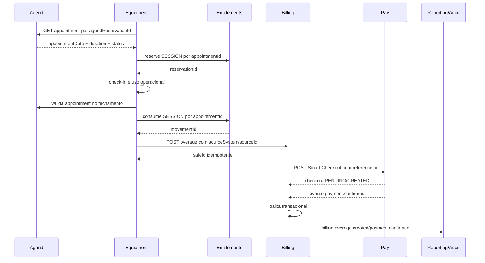

# Blueprint de comunicação do módulo financeiro da Operaon

## 1. Objetivo e princípio de comunicação

O módulo financeiro da Operaon deve operar com **Billing como owner da obrigação financeira**, **Pay como owner do processamento de pagamento** e **Entitlements como owner dos créditos e sessões**. Os demais módulos fornecem fatos de negócio ou consomem resultados financeiros, mas não devem duplicar esses estados.

> **Regra de comunicação:** comandos mudam estado no owner; eventos informam que o estado mudou; consultas retornam uma visão autorizada sem transferir ownership.

A comunicação deve ser dividida em dois canais. O canal **síncrono** é usado quando o chamador precisa de uma resposta imediata para continuar uma operação. O canal **assíncrono** é usado para confirmação, propagação, retry, reconciliação e integração de longa duração. Uma resposta HTTP `200` ou `201` confirma apenas que o comando foi aceito; não deve ser interpretada automaticamente como pagamento liquidado.

## 2. Participantes e direção autorizada

| Participante | Pode enviar comandos para | Pode receber eventos de | Responsabilidade |
| --- | --- | --- | --- |
| **Gateway/API** | Billing, Pay, Entitlements, Equipment e demais módulos conforme scope | Todos os eventos necessários à borda | Autenticação externa, autorização inicial, roteamento e composição de respostas |
| **Catalog** | Nenhum owner financeiro para mutações monetárias; fornece consultas autorizadas | Solicitações de resolução de preço | Produto, preço vigente, moeda e regra comercial |
| **Tenant & Organization** | Billing para consulta de pagador e dados fiscais | Eventos de cobrança relevantes | Identidade jurídica e contexto de cobrança |
| **Agend** | Equipment para appointment e janela temporal | Eventos de cancelamento ou alteração de appointment | Fonte de verdade temporal |
| **Equipment** | Entitlements para créditos; Billing para excedentes; Pay apenas pelo contrato autorizado | Eventos relacionados à cobrança e pagamento | Fato operacional de locação, check-in, check-out e uso |
| **Entitlements** | Nenhum módulo para dinheiro; executa comandos de reserva, consumo e liberação | Eventos de appointment, pagamento ou cancelamento quando aplicável | Créditos inteiros e sessões; unidade atual `SESSION` |
| **Billing** | Catalog, Tenant, Pay, Audit e Reporting por contratos explícitos | Eventos de uso, pagamento, estorno e chargeback | Venda, item, valor devido, fatura, recebível e baixa financeira |
| **Pay** | Provedor de pagamento | Billing, Audit e Reporting | Checkout, transação, webhook, estorno e chargeback |
| **Audit** | Apenas ingestão de eventos ou comandos administrativos autorizados | Eventos de todos os owners | Registro imutável e trilha de decisão |
| **Reporting** | Consultas a read models | Eventos financeiros e operacionais | Projeções e relatórios; não executa mutações |

O fluxo permitido deve ser explicitamente allowlisted. Um token válido do Billing, por exemplo, não deve autorizar automaticamente chamadas administrativas no Pay ou mutações no Entitlements.

## 3. Topologia recomendada

```text
Internet / Frontends
        |
        v
  Gateway / API pública
        |
        | rede privada + mTLS + JWT de serviço
        v
+----------------+       +----------------+       +----------------+
|    Agend       | ----> |   Equipment    | ----> |  Entitlements  |
+----------------+       +----------------+       +----------------+
        |                         |                         |
        |                         +----------------------> |
        |                                                   |
        +--------------------> +----------------+           |
                               |    Billing     | <----------+
                               +----------------+
                                       |
                                       | Smart Checkout
                                       v
                               +----------------+
                               |      Pay       |
                               +----------------+
                                       |
                                       | webhook assinado
                                       v
                               Provedor externo

Billing/Pay/Entitlements/Equipment -- outbox/event bus --> Audit e Reporting
```

A arquitetura atual pode iniciar com HTTP interno e outbox persistida. Quando o volume justificar, a outbox deve publicar em um broker. O contrato não deve depender de entrega exatamente uma vez; cada consumidor deve ser idempotente.

## 4. Canais de comunicação

| Canal | Uso | Característica | Exemplo |
| --- | --- | --- | --- |
| **HTTP síncrono interno** | Comandos e consultas imediatas | Resposta rápida, timeout curto, retry controlado | Equipment cria excedente no Billing |
| **Webhook externo** | Provedor informa pagamento | Assinatura obrigatória, replay protection | Pay recebe confirmação da Paytime |
| **Outbox** | Registrar evento na mesma transação do owner | Evita evento sem estado persistido | Billing registra `sale.created` |
| **Broker ou worker de entrega** | Entregar eventos a consumidores | Retry, backoff e DLQ | Billing entrega `payment.confirmed` |
| **Inbox** | Deduplicar eventos recebidos | `eventId` único por consumidor | Billing ignora webhook já processado |
| **Read model** | Consultas e dashboards | Eventual consistency, sem mutação cruzada | Reporting consulta receitas por tenant |

## 5. Identidade, headers e envelope canônico

Toda chamada interna deve carregar contexto técnico e de negócio. O cliente externo não pode definir livremente esses valores; o Gateway deve remover headers internos recebidos do cliente e recriá-los ou validá-los.

### 5.1. Headers internos

```http
Authorization: Bearer <service-jwt>
X-Service-Key: <compatibilidade-temporária>
X-Service-Id: operaon-equipment
X-Tenant-Id: tenant_01
X-Organization-Id: org_01
X-Correlation-Id: corr_01
X-Event-Id: evt_01
X-Source-System: equipment
Idempotency-Key: overage-rental_01-checkout_01
X-Request-Timestamp: 2026-08-14T23:00:00.000Z
X-Request-Nonce: nonce_01
```

`X-Service-Key` deve permanecer somente como compatibilidade de transição. O objetivo é migrar para mTLS e JWT de serviço com audience e scopes específicos.

### 5.2. Envelope de evento

```json
{
  "eventId": "evt_01H...",
  "eventType": "billing.overage.created",
  "eventVersion": 1,
  "sourceSystem": "billing",
  "sourceId": "sale_01H...",
  "tenantId": "tenant_01H...",
  "organizationId": "org_01H...",
  "correlationId": "corr_01H...",
  "occurredAt": "2026-08-14T23:00:00.000Z",
  "payload": {
    "saleId": "sale_01H...",
    "amount": 120.0,
    "currency": "BRL",
    "referenceId": "equipment-overage:rental_01:checkout_01"
  }
}
```

O evento precisa conter apenas dados necessários para o consumidor. Dados sensíveis do pagamento não devem ser publicados. O `eventId` identifica o evento; o `sourceId` identifica a entidade de origem; o `correlationId` acompanha a jornada inteira.

## 6. Matriz de comandos síncronos

| Origem | Destino | Comando/consulta | Resultado imediato | Não significa |
| --- | --- | --- | --- | --- |
| Gateway | Billing | Criar venda ou excedente | Venda criada ou já existente | Pagamento confirmado |
| Billing | Catalog | Resolver item e preço vigente | Snapshot de nome, moeda e preço | Preço histórico alterado |
| Billing | Tenant | Validar pagador e organização | Contexto autorizado | Aprovação financeira |
| Equipment | Agend | Consultar appointment por `agendReservationId` | Horário oficial e duração | Reserva concluída no Equipment |
| Equipment | Entitlements | Reservar, consumir ou liberar `SESSION` | Movimento criado ou replay idempotente | Pagamento financeiro |
| Billing | Pay | Criar Smart Checkout | Checkout `PENDING`/`CREATED` | Liquidação definitiva |
| Gateway | Pay | Consultar checkout autorizado | Estado do pagamento | Atualização do Billing sem evento |
| Billing | Audit | Registrar comando administrativo | Registro de auditoria aceito | Mutação no domínio financeiro |
| Reporting | Billing/Pay | Consultar read model ou endpoint de leitura | Dados de relatório | Permissão para alterar valores |

## 7. Contratos HTTP essenciais

### 7.1. Criar venda normal

```http
POST /api/sales
Authorization: Bearer <service-jwt>
Idempotency-Key: appointment_01
X-Source-System: agend
X-Source-Id: appointment_01
X-Correlation-Id: corr_01
Content-Type: application/json
```

```json
{
  "tenantId": "tenant_01",
  "organizationId": "org_01",
  "sourceSystem": "agend",
  "sourceId": "appointment_01",
  "items": [
    {
      "catalogItemId": "catalog_01",
      "description": "Sessão contratada",
      "quantity": 1,
      "unitPrice": 100.0,
      "currency": "BRL"
    }
  ],
  "event": {
    "eventId": "evt_01",
    "eventType": "appointment.billing.requested"
  }
}
```

O Billing cria `Sale`, `SaleItem`, descontos e totais na mesma transação. Em replay, devolve a venda original, desde que o payload seja equivalente. Se a mesma origem for usada com valor diferente, deve responder `409 IDEMPOTENCY_CONFLICT`.

### 7.2. Criar excedente do Equipment

```http
POST /api/internal/overages
Authorization: Bearer <service-jwt>
X-Service-Id: operaon-equipment
X-Source-System: equipment
X-Source-Id: rental_01:checkout_01
Idempotency-Key: rental_01:checkout_01
X-Correlation-Id: corr_01
```

```json
{
  "tenantId": "tenant_01",
  "organizationId": "org_01",
  "sourceSystem": "equipment",
  "sourceId": "rental_01:checkout_01",
  "rentalContractId": "rental_01",
  "checkoutId": "checkout_01",
  "catalogItemId": "catalog-overage-hour",
  "description": "Excedente de utilização do equipamento",
  "quantity": 2,
  "unitPrice": 60.0,
  "currency": "BRL",
  "event": {
    "eventId": "evt_01",
    "eventType": "equipment.overage.calculated",
    "occurredAt": "2026-08-14T23:00:00.000Z"
  }
}
```

O Equipment calcula os fatos de uso e envia quantidade e preço autorizados pelo contrato. O Billing valida o item e a permissão da origem, congela o snapshot e grava o excedente. O preço não deve ser aceito cegamente se o contrato exigir resolução pelo Catalog; nesse caso, o Billing compara o valor informado com uma regra autorizada.

### 7.3. Criar Smart Checkout

```http
POST /api/establishments/{establishmentId}/checkout
Authorization: Bearer <service-jwt>
X-Service-Id: operaon-billing
X-Correlation-Id: corr_01
Idempotency-Key: billing-sale_01
```

```json
{
  "title": "Excedente de utilização do equipamento",
  "amount": 120.0,
  "reference_id": "equipment-overage:rental_01:checkout_01",
  "tenantId": "tenant_01",
  "sourceSystem": "billing",
  "sourceId": "sale_01",
  "correlationId": "corr_01"
}
```

O Pay deve garantir unicidade de `establishmentId + reference_id`. Se a referência existir com o mesmo payload, devolve o checkout existente. Se existir com valor ou tenant diferentes, devolve `409 PAYMENT_REFERENCE_CONFLICT`.

### 7.4. Confirmar pagamento no Billing

A confirmação não deve depender somente de chamada do frontend. O Pay recebe o webhook assinado, persiste o evento e entrega ao Billing:

```json
{
  "eventId": "pay_evt_01",
  "eventType": "payment.confirmed",
  "sourceSystem": "pay",
  "sourceId": "payment_01",
  "tenantId": "tenant_01",
  "correlationId": "corr_01",
  "payload": {
    "saleId": "sale_01",
    "referenceId": "equipment-overage:rental_01:checkout_01",
    "providerTransactionId": "provider_01",
    "amount": 120.0,
    "currency": "BRL",
    "confirmedAt": "2026-08-14T23:01:00.000Z"
  }
}
```

O Billing aplica a baixa em uma transação e publica `billing.payment.confirmed` após o commit.

## 8. Eventos financeiros

| Evento | Produtor | Consumidores | Efeito |
| --- | --- | --- | --- |
| `appointment.created` | Agend | Equipment, Billing | Permite reservar janela e iniciar obrigação quando aplicável |
| `appointment.canceled` | Agend | Equipment, Entitlements, Billing | Libera reserva, cancela obrigação ou inicia regra de reembolso |
| `entitlement.reserved` | Entitlements | Equipment, Audit | Confirma reserva de uma `SESSION` |
| `entitlement.consumed` | Entitlements | Equipment, Billing, Reporting | Confirma consumo operacional |
| `equipment.checked_out` | Equipment | Audit, Reporting | Marca início do uso |
| `equipment.overage.calculated` | Equipment | Billing, Audit | Solicita cobrança idempotente do excedente |
| `billing.sale.created` | Billing | Pay, Audit, Reporting | Permite criar checkout ou atualizar projeções |
| `billing.overage.created` | Billing | Pay, Audit, Reporting | Excedente convertido em obrigação financeira |
| `payment.created` | Pay | Billing, Audit | Checkout criado |
| `payment.confirmed` | Pay | Billing, Audit, Reporting | Pagamento confirmado pelo provedor |
| `payment.failed` | Pay | Billing, Notification, Audit | Falha sem apagar a obrigação |
| `payment.refunded` | Pay | Billing, Entitlements, Audit | Estorno confirmado |
| `payment.chargeback` | Pay | Billing, Audit, Reporting | Contestação financeira |
| `billing.receivable.paid` | Billing | Reporting, Notification, Audit | Baixa financeira efetivada |
| `billing.refund.completed` | Billing | Reporting, Notification, Audit | Reembolso financeiro concluído |

Eventos de domínio não devem ser usados como comandos implícitos. Se o Billing precisa alterar um crédito, deve enviar um comando explícito ao Entitlements ou utilizar um consumidor com permissão claramente definida.

## 9. Fluxo completo de uma venda comum

1. O frontend envia uma solicitação ao Gateway.
2. O Gateway autentica o usuário, resolve tenant e organization e remove headers internos recebidos do cliente.
3. O Gateway envia um comando autenticado ao Billing.
4. O Billing consulta Catalog para validar o item e congela o preço.
5. O Billing cria `Sale` e `SaleItem` na mesma transação.
6. O Billing grava um evento na outbox antes de concluir a transação.
7. O Gateway ou worker solicita Smart Checkout ao Pay.
8. O Pay cria a transação com `reference_id` único.
9. O provedor retorna estado inicial; o Pay persiste `PENDING`.
10. O provedor envia webhook; o Pay valida assinatura e replay.
11. O Pay publica `payment.confirmed` ou `payment.failed`.
12. O Billing aplica baixa, mantém pendência ou agenda retentativa.
13. Billing publica o resultado para Notification, Audit e Reporting.
14. O frontend consulta o Billing para exibir o estado financeiro oficial.

## 10. Fluxo completo de Equipment com excedente



O Equipment deve persistir estados locais como `RESERVED`, `CHECKED_IN`, `IN_USE`, `CHECKED_OUT`, `OVERAGE_PENDING`, `OVERAGE_INVOICED`, `PAYMENT_PENDING`, `PAID` e `RECONCILIATION_REQUIRED`. Se Billing ou Pay estiverem indisponíveis, o fechamento operacional não deve ser perdido; ele deve ficar em estado pendente e ser reprocessado pela outbox do Equipment.

## 11. Fluxos de falha e compensação

| Falha | Estado recomendado | Ação |
| --- | --- | --- |
| Agend indisponível na reserva | `RESERVATION_PENDING` | Não criar reserva temporal local; retry com backoff |
| Entitlements indisponível | `CREDIT_PENDING` | Não confirmar retirada até reserva ou política de exceção autorizada |
| Billing indisponível no checkout | `OVERAGE_PENDING` | Persistir fato de uso e reenviar comando idempotente |
| Billing retorna conflito de origem | `RECONCILIATION_REQUIRED` | Comparar payload; nunca criar segunda venda |
| Pay indisponível | `PAYMENT_PENDING` | Manter cobrança emitida e permitir retry |
| Pay retorna referência conflitante | `PAYMENT_REFERENCE_CONFLICT` | Bloquear criação, auditar e investigar divergência |
| Webhook duplicado | Nenhuma mudança nova | Inbox reconhece `eventId` já processado |
| Webhook inválido | `WEBHOOK_REJECTED` | Não alterar pagamento; registrar alerta de segurança |
| Pagamento falha | `PAYMENT_FAILED` | Notificar, permitir nova tentativa e respeitar vencimento |
| Estorno falha | `REFUND_PENDING` | Retry controlado e reconciliação com provedor |
| Chargeback | `CHARGEBACK` | Bloquear baixa como definitiva e abrir fluxo de disputa |

Não deve haver transação distribuída entre Equipment, Entitlements, Billing e Pay. O processo deve usar **saga**, estados intermediários, outbox, inbox e compensações explícitas. A consistência é eventual entre serviços, mas cada owner deve ser transacional dentro do próprio banco.

## 12. Idempotência em quatro camadas

| Camada | Chave | Regra |
| --- | --- | --- |
| HTTP | `Idempotency-Key` | Repetição da mesma chamada devolve o mesmo resultado |
| Negócio | `sourceSystem + sourceId` | Mesmo fato de negócio nunca gera duas vendas |
| Evento | `eventId` | Mesmo evento não é processado duas vezes pelo mesmo consumidor |
| Pay | `establishmentId + reference_id` | Mesmo checkout não é duplicado |

Se uma chave for reapresentada com payload diferente, a resposta deve ser `409` com código de conflito. O banco deve possuir índices únicos; lookup anterior ao `INSERT` não é suficiente contra concorrência.

## 13. Retry, backoff e dead-letter queue

Os retries devem ocorrer somente para erros transitórios, como timeout, conexão recusada, HTTP `408`, `429` e `5xx`. Erros de validação, autenticação, autorização, tenant incompatível e conflito de idempotência não devem ser repetidos automaticamente.

| Tentativa | Intervalo sugerido | Observação |
| --- | --- | --- |
| 1 | Imediata | Falha transitória simples |
| 2 | 5 segundos | Mantém a mesma chave de idempotência |
| 3 | 30 segundos | Registra tentativa no log estruturado |
| 4 | 5 minutos | Reprocessamento assíncrono |
| 5 | 30 minutos | Última tentativa automática comum |
| Final | DLQ | Exige alerta e tratamento operacional |

A DLQ deve guardar payload, headers não sensíveis, erro, número de tentativas, último timestamp, `eventId`, `sourceId` e `correlationId`. O replay da DLQ deve ser uma ação autorizada e preservar a mesma identidade de negócio; nunca deve gerar uma nova origem apenas para contornar idempotência.

## 14. Segurança da comunicação

Os módulos devem estar em rede privada e não devem aceitar chamadas públicas diretas. O Gateway é a entrada externa. A comunicação interna deve evoluir para TLS/mTLS e JWT de serviço com `issuer`, `audience`, `scope`, `tenantId`, `organizationId`, `sub`, `azp` e expiração curta.

O JWT do usuário e o JWT de serviço são contextos diferentes. O Gateway valida o usuário e o serviço valida a identidade do Gateway. Um token emitido para `operaon-equipment` não deve ser aceito pelo Pay se sua audience for `operaon-billing`.

O Gateway deve remover e recriar headers como `X-Source-System`, `X-Event-Id`, `X-Tenant-Id` e `X-Organization-Id`. `X-Correlation-Id` é rastreabilidade, não autenticação. Webhooks do Pay precisam de assinatura, janela temporal e proteção contra replay. Dados de cartão, CVV, tokens privados e chaves de serviço nunca devem aparecer em eventos ou logs.

## 15. Outbox e inbox

Cada owner deve persistir sua alteração de domínio e seu evento de outbox na mesma transação. Um worker publica eventos pendentes, marca a entrega e reprocessa falhas. O consumidor persiste o `eventId` antes ou junto da mutação local, de forma que uma segunda entrega seja reconhecida como replay.

```text
BEGIN
  UPDATE billing_state
  INSERT INTO financial_outbox(event_id, event_type, payload)
COMMIT

worker -> publica evento
consumer -> valida envelope
consumer -> verifica inbox(event_id)
consumer -> aplica mutação local
consumer -> registra inbox(event_id)
```

Se o worker cair depois do commit e antes da publicação, o evento permanece na outbox. Se o consumidor cair depois de aplicar a mutação, a inbox impede duplicação no retry.

## 16. Observabilidade

Todos os logs estruturados devem conter `service`, `environment`, `tenantId`, `organizationId`, `correlationId`, `eventId`, `sourceSystem`, `sourceId`, `operation`, `status`, `durationMs` e `attempt`. Nunca devem conter segredo, número de cartão ou payload completo de webhook sensível.

As métricas mínimas são:

| Métrica | Uso |
| --- | --- |
| Latência p50/p95/p99 por endpoint interno | Identificar degradação |
| Taxa de `4xx`, `5xx`, timeout e `429` | Separar erro de contrato de indisponibilidade |
| Vendas criadas, duplicadas evitadas e conflitos | Verificar idempotência |
| Checkouts `PENDING`, `CONFIRMED`, `FAILED` | Acompanhar o Pay |
| Outbox pendente e idade máxima | Detectar atraso de eventos |
| DLQ por consumidor | Detectar falhas persistentes |
| Divergências de conciliação | Controlar risco financeiro |
| Estornos, chargebacks e pagamentos vencidos | Controle operacional |

Traces distribuídos devem usar `correlationId` e propagar contexto W3C Trace Context quando disponível. Alertas devem ser acionados para crescimento de DLQ, aumento de conflitos de referência, webhook inválido, outbox antiga e divergência financeira acima do limite.

## 17. Conciliação

A conciliação compara periodicamente Billing, Pay, provedor, Entitlements, Equipment e Agend. O processo não deve alterar automaticamente o estado sem regra aprovada.

| Comparação | Divergência típica |
| --- | --- |
| Billing × Pay | Venda paga no Pay sem baixa no Billing |
| Pay × provedor | Transação local sem liquidação externa |
| Billing × Equipment | Excedente operacional sem venda |
| Equipment × Entitlements | Sessão consumida sem fechamento correspondente |
| Entitlements × Agend | Crédito associado a appointment cancelada |
| Billing × Catalog | Item ou preço não mais existente, mas snapshot preservado |

Cada divergência recebe `reconciliationId`, valores esperado e observado, origem, causa provável, responsável, status e decisão. Ajustes manuais precisam de autorização e evento de auditoria.

## 18. Contrato de erros

Os serviços devem usar códigos estáveis, além do status HTTP:

```json
{
  "error": {
    "code": "IDEMPOTENCY_CONFLICT",
    "message": "A origem já está associada a uma operação diferente.",
    "correlationId": "corr_01",
    "retryable": false
  }
}
```

Códigos sugeridos incluem `AUTHENTICATION_FAILED`, `FORBIDDEN_SCOPE`, `TENANT_MISMATCH`, `VALIDATION_ERROR`, `IDEMPOTENCY_CONFLICT`, `PAYMENT_REFERENCE_CONFLICT`, `UPSTREAM_TIMEOUT`, `UPSTREAM_UNAVAILABLE`, `WEBHOOK_INVALID`, `PAYMENT_FAILED` e `RECONCILIATION_REQUIRED`.

## 19. Processo operacional resumido

O processo completo é: **Agend confirma o tempo; Equipment confirma o uso; Entitlements confirma a sessão; Equipment solicita o excedente; Billing registra o valor devido; Pay processa o pagamento; Pay confirma pelo webhook; Billing efetua a baixa; Audit registra a decisão; Reporting projeta a informação**.

A comunicação síncrona apenas cria ou consulta estados. A comunicação assíncrona confirma resultados e recupera falhas. A outbox protege a publicação; a inbox protege o consumo; as chaves de negócio protegem contra duplicidade; a conciliação detecta divergências; e o Gateway limita a superfície de exposição.

## 20. Ordem de implementação recomendada

| Ordem | Entrega | Resultado esperado |
| --- | --- | --- |
| 1 | Padronizar envelope, headers e códigos de erro | Contrato único entre módulos |
| 2 | Criar outbox no Billing, Pay e Equipment | Nenhum evento perdido após commit |
| 3 | Criar inbox nos consumidores | Replays seguros |
| 4 | Implementar máquina de estados do Equipment | Check-out não perdido quando Billing/Pay falhar |
| 5 | Padronizar webhooks assinados do Pay | Confirmação confiável |
| 6 | Implementar retries, DLQ e replay autorizado | Resiliência operacional |
| 7 | Aplicar mTLS, audiences e scopes | Comunicação interna com identidade forte |
| 8 | Criar reconciliação e alertas | Detecção de divergências financeiras |
| 9 | Integrar Audit e Reporting por eventos | Rastreabilidade e visão analítica |

## 21. Referências

[1]: https://github.com/operaon/faturament "Operaon Billing"
[2]: https://github.com/operaon/pay "Operaon Pay"
[3]: https://github.com/operaon/entitlements "Operaon Entitlements"
[4]: https://github.com/operaon/equipment "Operaon Equipment"
[5]: https://github.com/operaon/agend "Operaon Agend"
[6]: https://github.com/operaon/catalog "Operaon Catalog"
[7]: https://github.com/operaon/audit "Operaon Audit"
[8]: https://github.com/operaon/reporting "Operaon Reporting"
[9]: https://csrc.nist.gov/pubs/sp/800/207/final "NIST SP 800-207 — Zero Trust Architecture"
[10]: https://owasp.org/API-Security/editions/2023/en/0x11-t10/ "OWASP API Security Top 10"
